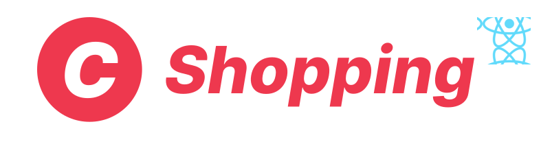
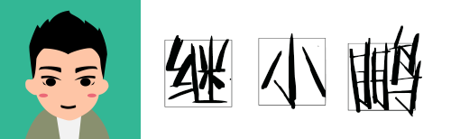

## Hey 👋, My name is Jipeng Huang!

I'm an explorer of new tech, an avid learner, and a problem-solver at heart.
 
 

  
### More About Me:

- 🌍 &nbsp; I'm based in Beijing
- 🎓 &nbsp; Full stack engineer
- 🖥️ &nbsp; See my blog at [blog.huanghanlian.com](https://blog.huanghanlian.com/)
- 🤝 &nbsp; I'm open to collaborating on any web or mobile project
- 💬 &nbsp; Ask me anything [here](https://blog.huanghanlian.com/guestbook)! I am happy to help.
- 👾 &nbsp; Fun fact: Equal is Not Always Equal in JS.
- 📫 &nbsp; Reach me out: h1319639755@gmail.com.

 

### Languages and Tools:

  
  
  
  
  
  
  
  
  
  
  
  
  
  
  
  
  

 
 
 

### Github Stats:

  
  
  
   

  

 

### My Projects:

